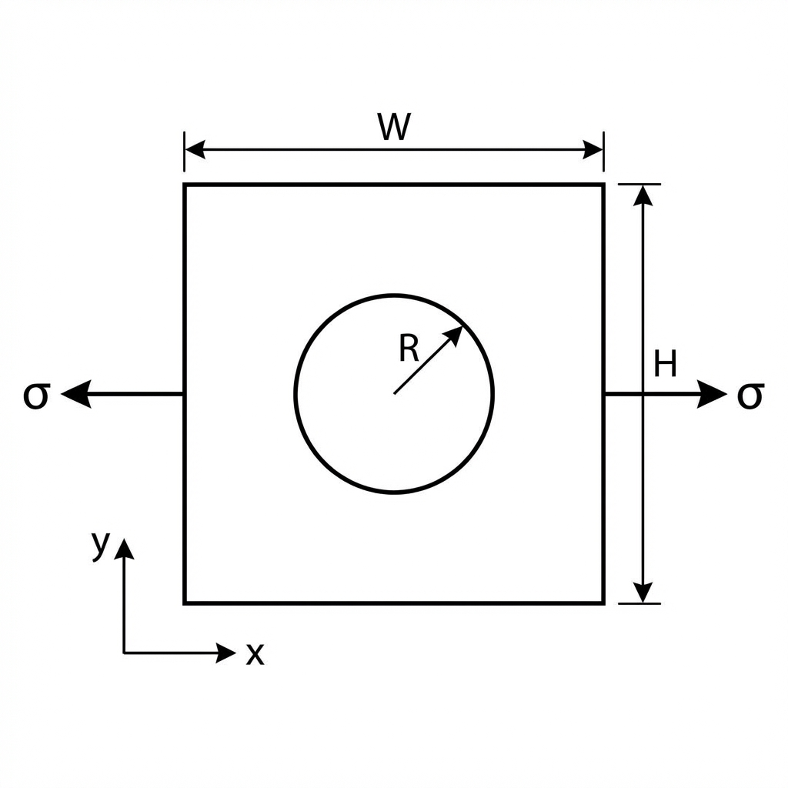

Getting Started: Isotropic Plate Example
========================================

This example walks through setting up a simple stress analysis for a square isotropic plate with a circular cutout in the center, subjected to uniaxial tension.

Problem Description
-------------------

We will analyze a 10.0 in x 10.0 in square plate with a 1.0 in diameter hole (radius :math:`R = 0.5 \text{ in}`) at the center. The material is aluminum (isotropic), and we apply a 1,000 psi tensile load to the horizontal edges.

Free Body Diagram (FBD)
-----------------------

Simulation Workflow
-------------------

The following chart outlines the process for setting up and solving a problem in Panelyze:

.. mermaid::

   graph TD
       A[Material Definition] --> B[Geometry Creation]
       B --> C[Boundary Discretization]
       C --> D[Matrix Assembly]
       D --> E[Apply BCs & Constraints]
       E --> F[Solve Unknowns]
       F --> G[Extract Results]

Step-by-Step Implementation
---------------------------

1. Define the Material
~~~~~~~~~~~~~~~~~~~~~~

For an isotropic material, we set :math:`E_1 = E_2` and calculate :math:`G_{12}` from :math:`E` and :math:`\nu`. Note: Purely isotropic materials result in identical characteristic roots (:math:`\mu_1 = \mu_2 = i`), which can cause numerical singularities in the anisotropic formulation. We use a **pseudo-isotropic** approach by applying a small 0.1% perturbation to :math:`E_2`.

.. code-block:: python

   import numpy as np
   from panelyze.analysis.material import OrthotropicMaterial

   E = 10.0e6  # psi (Aluminum)
   nu = 0.33
   G = E / (2 * (1 + nu))

   # Use pseudo-isotropic modulus to avoid Lechenitskii singularity
   mat = OrthotropicMaterial(e1=E, e2=E*1.001, nu12=nu, g12=G)

2. Create Geometry and Mesh
~~~~~~~~~~~~~~~~~~~~~~~~~~~

Define the panel dimensions and add a circular cutout.

.. code-block:: python

   from panelyze.analysis.geometry import PanelGeometry, CircularCutout

   W, H = 10.0, 10.0
   radius = 0.5
   geom = PanelGeometry(W, H)
   geom.add_cutout(CircularCutout(x_center=W/2, y_center=H/2, radius=radius))

   # Discretize the boundary
   n_side = 20
   elements = geom.discretize(num_elements_per_side=n_side, num_elements_cutout=80)

3. Assemble and Solve
~~~~~~~~~~~~~~~~~~~~~

Using the `BEMKernels` and `BEMSolver` to find the unknown boundary values. We apply the loading as tractions and constrain the corners to remove rigid body modes.

.. code-block:: python

   from panelyze.analysis.kernels import BEMKernels
   from panelyze.analysis.solver import BEMSolver

   kernels = BEMKernels(mat)
   solver = BEMSolver(kernels, elements)
   solver.assemble()

   # Define Boundary Conditions (BCs)
   num_dofs = 2 * len(elements)
   bc_type = np.zeros(num_dofs, dtype=int)  # 0 = Traction given
   bc_value = np.zeros(num_dofs)

   # 1. Apply Traction BCs (1,000 psi Tension)
   sigma = 1000.0
   for i, el in enumerate(elements):
       if np.isclose(el.center[0], 0.0): # Left Edge
           bc_value[2*i] = -sigma
       elif np.isclose(el.center[0], W): # Right Edge
           bc_value[2*i] = sigma

   # 2. Apply Displacement BCs (Corner Constraints)
   # Bottom-left corner (~element 0): Fixed in X and Y (u=v=0)
   bc_type[0:2] = 1
   bc_value[0:2] = 0.0

   # Bottom-right corner (~element n_side-1): Fixed in Y (v=0)
   k_br = n_side - 1
   bc_type[2*k_br + 1] = 1
   bc_value[2*k_br + 1] = 0.0

   u, t = solver.solve(bc_type, bc_value)

4. Extract Results
~~~~~~~~~~~~~~~~~~

Evaluate the stress at the stress concentration point (tip of the hole at :math:`\theta = 90^\circ`).

.. code-block:: python

   # Point at theta=90 deg relative to hole center
   # Evaluate at r=0.51 in (1.02R) for numerical stability
   eval_pt = np.array([[W/2, H/2 + 0.51]])
   stresses = solver.compute_stress(eval_pt, u, t)

   print(f"Sigma_xx at hole pole: {stresses[0, 0]:.1f} psi")

Verification Results
--------------------

The following code block is verified during documentation builds using the Sphinx `doctest` extension.

.. testcode::

   import numpy as np
   from panelyze.analysis.material import OrthotropicMaterial
   from panelyze.analysis.geometry import PanelGeometry, CircularCutout
   from panelyze.analysis.kernels import BEMKernels
   from panelyze.analysis.solver import BEMSolver

   E, nu = 10.0e6, 0.33
   G = E / (2 * (1 + nu))
   mat = OrthotropicMaterial(e1=E, e2=E*1.001, nu12=nu, g12=G)

   W, H = 10.0, 10.0
   geom = PanelGeometry(W, H)
   geom.add_cutout(CircularCutout(W/2, H/2, 0.5))

   n_side = 20
   elements = geom.discretize(num_elements_per_side=n_side, num_elements_cutout=80)

   solver = BEMSolver(BEMKernels(mat), elements)
   solver.assemble()

   bc_type = np.zeros(2 * len(elements), dtype=int)
   bc_value = np.zeros(2 * len(elements))

   sigma = 1000.0
   for i, el in enumerate(elements):
       if np.isclose(el.center[0], 0.0): bc_value[2*i] = -sigma
       if np.isclose(el.center[0], W):   bc_value[2*i] = sigma

   bc_type[0:2] = 1
   bc_value[0:2] = 0.0
   bc_type[2*(n_side - 1) + 1] = 1
   bc_value[2*(n_side - 1) + 1] = 0.0

   u, t = solver.solve(bc_type, bc_value)

   eval_pts = np.array([[W/2, H/2 + 0.51]])
   stress = solver.compute_stress(eval_pts, u, t)

   # Expect SCF ~2.94
   scf = stress[0, 0] / sigma
   print(f"SCF: {scf:.2f}")

.. testoutput::

   SCF: 2.94
